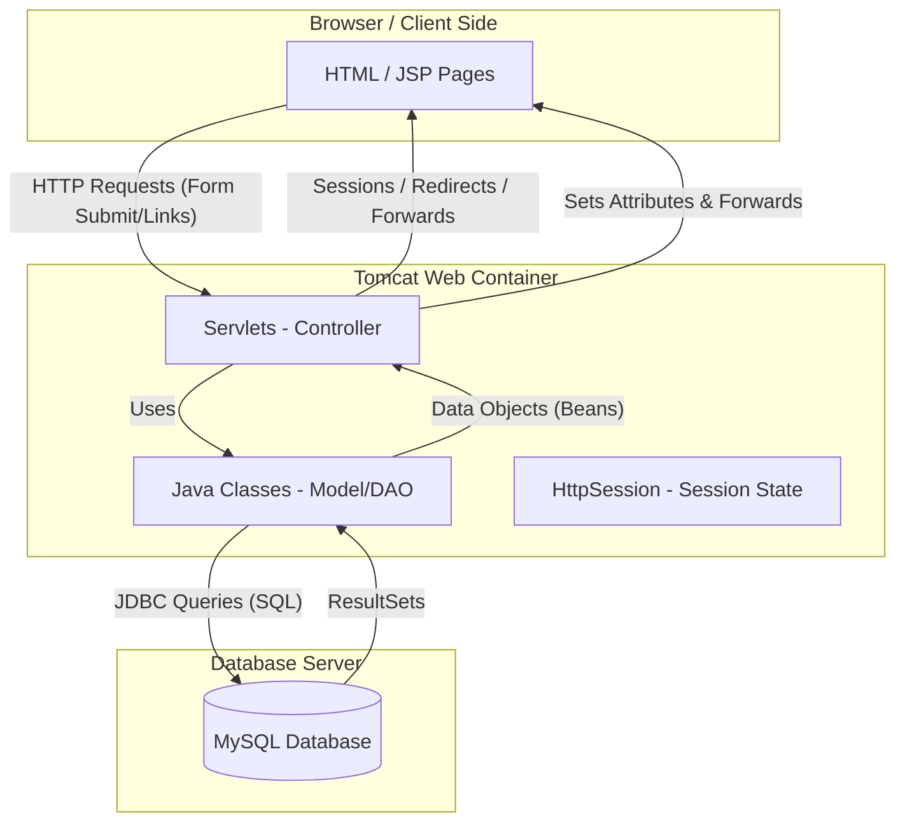
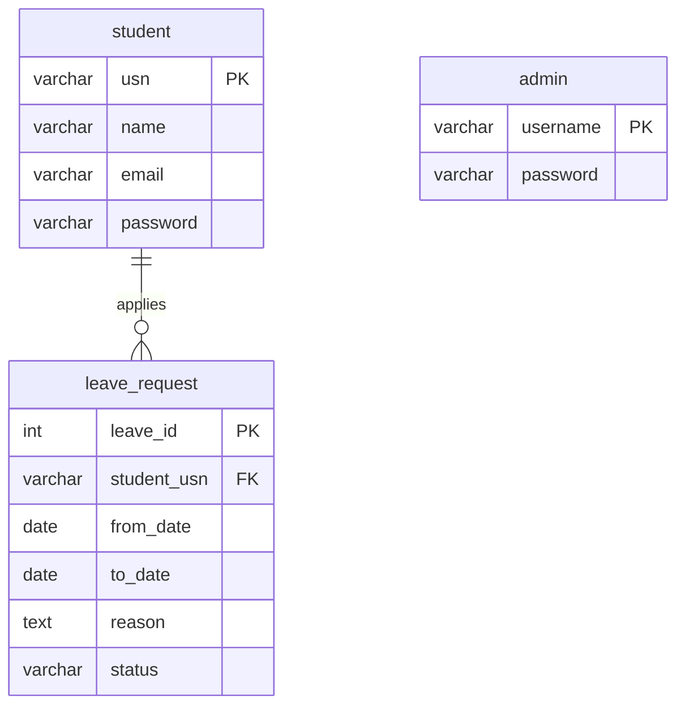
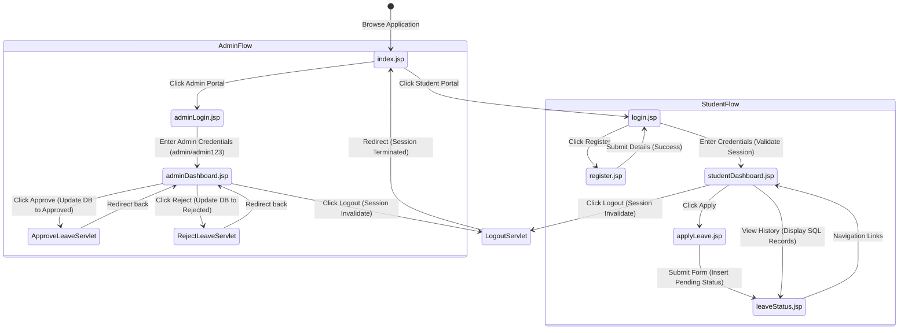

# Student Online Leave Application System
## Advanced Java Mini Project Report & Complete Source Code

---

## 1. Project Introduction
The **Student Online Leave Application System** is a web-based application designed to digitize and streamline the process of applying for and managing student leave requests. Traditionally, students submit paper-based leave applications to their class teachers or department heads, which is time-consuming, prone to loss, and difficult to track. 

This project replaces the manual process with an automated, role-based system. Students can register, login, apply for leave online, and check the live status of their requests. Administrators (faculty or department heads) can view all incoming requests, check registered student details, and approve or reject applications with a single click.

---

## 2. Objectives
*   **Automation:** Eliminate manual paper-based leave submissions.
*   **Transparency:** Allow students to track their leave status in real-time.
*   **Administrative Efficiency:** Enable admins to view, approve, or reject leave requests quickly.
*   **Data Integrity:** Maintain a persistent database of registered students and leave history.
*   **Academic Application:** Implement core Advanced Java concepts: Servlets, JSP, JDBC, Session Management, and MySQL.

---

## 3. System Architecture Diagram



### Architectural Explanation:
1.  **Client Tier (Browser):** The user interacts with the system via HTML/JSP pages. They fill out forms and click buttons to trigger requests.
2.  **Web Tier (Controller & Session):** Apache Tomcat hosts the Servlets. The Servlets handle business logic, process forms, manage sessions using `HttpSession`, and coordinate navigation.
3.  **Data Access Tier (JDBC & Model):** Standard Java classes (`DBConnection.java`, Beans) use JDBC (Java Database Connectivity) to load the MySQL driver, establish database connections, and run SQL queries.
4.  **Database Tier (MySQL):** Stores persistent records for students, administrators, and leave requests.

---

## 4. Database Design & MySQL Queries

### Schema Representation
The system uses a MySQL database named `student_leave_db` with three primary tables:
1.  **`student`**: Stores student registration information.
2.  **`admin`**: Stores administrator credentials.
3.  **`leave_request`**: Stores details of each leave application, linked to the student via foreign key.



### Complete MySQL Script
Execute these queries in your MySQL client (e.g., Command Line, phpMyAdmin, or MySQL Workbench) to set up the database:

```sql
-- Create Database
CREATE DATABASE IF NOT EXISTS student_leave_db;
USE student_leave_db;

-- 1. Create Student Table
CREATE TABLE IF NOT EXISTS student (
    usn VARCHAR(20) PRIMARY KEY,
    name VARCHAR(100) NOT NULL,
    email VARCHAR(100) UNIQUE NOT NULL,
    password VARCHAR(100) NOT NULL
);

-- 2. Create Admin Table
CREATE TABLE IF NOT EXISTS admin (
    username VARCHAR(50) PRIMARY KEY,
    password VARCHAR(50) NOT NULL
);

-- 3. Create Leave Request Table
CREATE TABLE IF NOT EXISTS leave_request (
    leave_id INT AUTO_INCREMENT PRIMARY KEY,
    student_usn VARCHAR(20),
    from_date DATE NOT NULL,
    to_date DATE NOT NULL,
    reason TEXT NOT NULL,
    status VARCHAR(20) DEFAULT 'Pending',
    FOREIGN KEY (student_usn) REFERENCES student(usn) ON DELETE CASCADE
);

-- Insert Predefined Admin Credentials
INSERT INTO admin (username, password) 
VALUES ('admin', 'admin123')
ON DUPLICATE KEY UPDATE password=password;

-- Insert Sample Students
INSERT INTO student (usn, name, email, password) 
VALUES 
('1SG24CS001', 'Rahul Kumar', 'rahul@gmail.com', 'rahul123'),
('1SG24CS002', 'Sneha Sen', 'sneha@gmail.com', 'sneha123');

-- Insert Sample Leave Requests
INSERT INTO leave_request (student_usn, from_date, to_date, reason, status) 
VALUES 
('1SG24CS001', '2026-06-15', '2026-06-17', 'Medical Leave: Suffering from flu', 'Pending'),
('1SG24CS002', '2026-06-20', '2026-06-21', 'Attending brother\'s wedding', 'Approved');
```

---

## 5. Folder Structure
Ensure your Dynamic Web Project in Eclipse, NetBeans, or manual Tomcat folder structure is organized as follows:

```text
StudentLeaveSystem/
│
├── WebContent/ (or web/ in some IDEs)
│   ├── index.jsp
│   ├── register.jsp
│   ├── login.jsp
│   ├── studentDashboard.jsp
│   ├── applyLeave.jsp
│   ├── leaveStatus.jsp
│   ├── adminLogin.jsp
│   ├── adminDashboard.jsp
│   │
│   └── WEB-INF/
│       ├── web.xml
│       └── lib/
│           └── mysql-connector-j-8.x.x.jar (MySQL JDBC Driver)
│
└── src/
    └── com/
        └── project/
            ├── model/
            │   ├── Student.java
            │   └── LeaveRequest.java
            │
            ├── util/
            │   └── DBConnection.java
            │
            └── servlet/
                ├── RegisterServlet.java
                ├── LoginServlet.java
                ├── LeaveServlet.java
                ├── ViewLeaveServlet.java
                ├── AdminLoginServlet.java
                ├── ApproveLeaveServlet.java
                ├── RejectLeaveServlet.java
                └── LogoutServlet.java
```

---

## 6. Complete Java Source Code (Classes & Servlets)

### DBConnection.java
*   **File Name:** `DBConnection.java`
*   **Path:** `src/com/project/util/DBConnection.java`
*   **Purpose:** Provides a centralized helper method to load the MySQL Driver class and establish a JDBC connection to the database.

```java
package com.project.util;

import java.sql.Connection;
import java.sql.DriverManager;
import java.sql.SQLException;

public class DBConnection {
    // Database URL, Username, and Password
    private static final String URL = "jdbc:mysql://localhost:3306/student_leave_db?useSSL=false&allowPublicKeyRetrieval=true";
    private static final String USER = "root";
    private static final String PASSWORD = "password"; // Update this with your MySQL password

    public static Connection getConnection() {
        Connection conn = null;
        try {
            // Load MySQL Driver class
            Class.forName("com.mysql.cj.jdbc.Driver");
            // Establish Connection
            conn = DriverManager.getConnection(URL, USER, PASSWORD);
        } catch (ClassNotFoundException e) {
            System.err.println("MySQL Driver not found: " + e.getMessage());
        } catch (SQLException e) {
            System.err.println("Connection failed: " + e.getMessage());
        }
        return conn;
    }
}
```

---

### Student.java
*   **File Name:** `Student.java`
*   **Path:** `src/com/project/model/Student.java`
*   **Purpose:** Simple Java Bean representing a Student object to hold registration details.

```java
package com.project.model;

import java.io.Serializable;

public class Student implements Serializable {
    private static final long serialVersionUID = 1L;
    
    private String usn;
    private String name;
    private String email;
    private String password;

    public Student() {}

    public Student(String usn, String name, String email, String password) {
        this.usn = usn;
        this.name = name;
        this.email = email;
        this.password = password;
    }

    public String getUsn() { return usn; }
    public void setUsn(String usn) { this.usn = usn; }

    public String getName() { return name; }
    public void setName(String name) { this.name = name; }

    public String getEmail() { return email; }
    public void setEmail(String email) { this.email = email; }

    public String getPassword() { return password; }
    public void setPassword(String password) { this.password = password; }
}
```

---

### LeaveRequest.java
*   **File Name:** `LeaveRequest.java`
*   **Path:** `src/com/project/model/LeaveRequest.java`
*   **Purpose:** Java Bean representing a single leave application request.

```java
package com.project.model;

import java.io.Serializable;

public class LeaveRequest implements Serializable {
    private static final long serialVersionUID = 1L;

    private int leaveId;
    private String studentUsn;
    private String studentName; // Utility field for admin display
    private String fromDate;
    private String toDate;
    private String reason;
    private String status;

    public LeaveRequest() {}

    public int getLeaveId() { return leaveId; }
    public void setLeaveId(int leaveId) { this.leaveId = leaveId; }

    public String getStudentUsn() { return studentUsn; }
    public void setStudentUsn(String studentUsn) { this.studentUsn = studentUsn; }

    public String getStudentName() { return studentName; }
    public void setStudentName(String studentName) { this.studentName = studentName; }

    public String getFromDate() { return fromDate; }
    public void setFromDate(String fromDate) { this.fromDate = fromDate; }

    public String getToDate() { return toDate; }
    public void setToDate(String toDate) { this.toDate = toDate; }

    public String getReason() { return reason; }
    public void setReason(String reason) { this.reason = reason; }

    public String getStatus() { return status; }
    public void setStatus(String status) { this.status = status; }
}
```

---

### RegisterServlet.java
*   **File Name:** `RegisterServlet.java`
*   **Path:** `src/com/project/servlet/RegisterServlet.java`
*   **Purpose:** Receives user registration input, validates it, inserts records into the database, and redirects to the login page.

```java
package com.project.servlet;

import java.io.IOException;
import java.sql.Connection;
import java.sql.PreparedStatement;
import java.sql.SQLException;
import com.project.util.DBConnection;

import javax.servlet.ServletException;
import javax.servlet.annotation.WebServlet;
import javax.servlet.http.HttpServlet;
import javax.servlet.http.HttpServletRequest;
import javax.servlet.http.HttpServletResponse;

@WebServlet("/RegisterServlet")
public class RegisterServlet extends HttpServlet {
    private static final long serialVersionUID = 1L;

    protected void doPost(HttpServletRequest request, HttpServletResponse response) 
            throws ServletException, IOException {
        
        String name = request.getParameter("name");
        String usn = request.getParameter("usn");
        String email = request.getParameter("email");
        String password = request.getParameter("password");

        // Basic Server Side Validation
        if (name == null || name.trim().isEmpty() ||
            usn == null || usn.trim().isEmpty() ||
            email == null || email.trim().isEmpty() ||
            password == null || password.trim().isEmpty()) {
            
            request.setAttribute("errorMsg", "All fields are required!");
            request.getRequestDispatcher("register.jsp").forward(request, response);
            return;
        }

        Connection conn = DBConnection.getConnection();
        if (conn == null) {
            request.setAttribute("errorMsg", "Database connection error!");
            request.getRequestDispatcher("register.jsp").forward(request, response);
            return;
        }

        String sql = "INSERT INTO student (usn, name, email, password) VALUES (?, ?, ?, ?)";
        try (PreparedStatement ps = conn.prepareStatement(sql)) {
            ps.setString(1, usn.trim().toUpperCase());
            ps.setString(2, name.trim());
            ps.setString(3, email.trim().toLowerCase());
            ps.setString(4, password);

            int result = ps.executeUpdate();
            if (result > 0) {
                // Success: Redirect to login
                response.sendRedirect("login.jsp?successMsg=Registration successful! Please login.");
            } else {
                request.setAttribute("errorMsg", "Registration failed. Try again.");
                request.getRequestDispatcher("register.jsp").forward(request, response);
            }
        } catch (SQLException e) {
            String msg = e.getMessage();
            if (msg.contains("Duplicate entry") || msg.contains("PRIMARY")) {
                request.setAttribute("errorMsg", "Student with this USN/Email already exists.");
            } else {
                request.setAttribute("errorMsg", "Database Error: " + msg);
            }
            request.getRequestDispatcher("register.jsp").forward(request, response);
        } finally {
            try {
                conn.close();
            } catch (SQLException e) {
                e.printStackTrace();
            }
        }
    }
}
```

---

### LoginServlet.java
*   **File Name:** `LoginServlet.java`
*   **Path:** `src/com/project/servlet/LoginServlet.java`
*   **Purpose:** Validates student login credentials via JDBC, creates an active `HttpSession`, stores student details in the session, and redirects to the Student Dashboard.

```java
package com.project.servlet;

import java.io.IOException;
import java.sql.Connection;
import java.sql.PreparedStatement;
import java.sql.ResultSet;
import java.sql.SQLException;
import com.project.util.DBConnection;
import com.project.model.Student;

import javax.servlet.ServletException;
import javax.servlet.annotation.WebServlet;
import javax.servlet.http.HttpServlet;
import javax.servlet.http.HttpServletRequest;
import javax.servlet.http.HttpServletResponse;
import javax.servlet.http.HttpSession;

@WebServlet("/LoginServlet")
public class LoginServlet extends HttpServlet {
    private static final long serialVersionUID = 1L;

    protected void doPost(HttpServletRequest request, HttpServletResponse response) 
            throws ServletException, IOException {
        
        String usnOrEmail = request.getParameter("username");
        String password = request.getParameter("password");

        if (usnOrEmail == null || usnOrEmail.trim().isEmpty() ||
            password == null || password.trim().isEmpty()) {
            
            request.setAttribute("errorMsg", "Please enter both credentials.");
            request.getRequestDispatcher("login.jsp").forward(request, response);
            return;
        }

        Connection conn = DBConnection.getConnection();
        if (conn == null) {
            request.setAttribute("errorMsg", "Database Server down.");
            request.getRequestDispatcher("login.jsp").forward(request, response);
            return;
        }

        String sql = "SELECT * FROM student WHERE (usn = ? OR email = ?) AND password = ?";
        try (PreparedStatement ps = conn.prepareStatement(sql)) {
            ps.setString(1, usnOrEmail.trim());
            ps.setString(2, usnOrEmail.trim());
            ps.setString(3, password);

            ResultSet rs = ps.executeQuery();
            if (rs.next()) {
                // User validated: Populate Student Bean
                Student student = new Student();
                student.setUsn(rs.getString("usn"));
                student.setName(rs.getString("name"));
                student.setEmail(rs.getString("email"));

                // Create Session
                HttpSession session = request.getSession(true);
                session.setAttribute("user", student);
                session.setAttribute("role", "student");

                // Redirect to Dashboard
                response.sendRedirect("studentDashboard.jsp");
            } else {
                request.setAttribute("errorMsg", "Invalid USN/Email or Password!");
                request.getRequestDispatcher("login.jsp").forward(request, response);
            }
        } catch (SQLException e) {
            request.setAttribute("errorMsg", "Database Error: " + e.getMessage());
            request.getRequestDispatcher("login.jsp").forward(request, response);
        } finally {
            try {
                conn.close();
            } catch (SQLException e) {
                e.printStackTrace();
            }
        }
    }
}
```

---

### LeaveServlet.java
*   **File Name:** `LeaveServlet.java`
*   **Path:** `src/com/project/servlet/LeaveServlet.java`
*   **Purpose:** Process leave application request forms from students, check session validation, and insert the request details into the database with a default status of "Pending".

```java
package com.project.servlet;

import java.io.IOException;
import java.sql.Connection;
import java.sql.PreparedStatement;
import java.sql.SQLException;
import com.project.util.DBConnection;
import com.project.model.Student;

import javax.servlet.ServletException;
import javax.servlet.annotation.WebServlet;
import javax.servlet.http.HttpServlet;
import javax.servlet.http.HttpServletRequest;
import javax.servlet.http.HttpServletResponse;
import javax.servlet.http.HttpSession;

@WebServlet("/LeaveServlet")
public class LeaveServlet extends HttpServlet {
    private static final long serialVersionUID = 1L;

    protected void doPost(HttpServletRequest request, HttpServletResponse response) 
            throws ServletException, IOException {
        
        HttpSession session = request.getSession(false);
        if (session == null || session.getAttribute("user") == null || !"student".equals(session.getAttribute("role"))) {
            response.sendRedirect("login.jsp?errorMsg=Unauthorized access. Please login first.");
            return;
        }

        Student student = (Student) session.getAttribute("user");
        String fromDate = request.getParameter("fromDate");
        String toDate = request.getParameter("toDate");
        String reason = request.getParameter("reason");

        if (fromDate == null || fromDate.isEmpty() ||
            toDate == null || toDate.isEmpty() ||
            reason == null || reason.trim().isEmpty()) {
            
            request.setAttribute("errorMsg", "All leave fields are required!");
            request.getRequestDispatcher("applyLeave.jsp").forward(request, response);
            return;
        }

        Connection conn = DBConnection.getConnection();
        if (conn == null) {
            request.setAttribute("errorMsg", "Connection Failed.");
            request.getRequestDispatcher("applyLeave.jsp").forward(request, response);
            return;
        }

        String sql = "INSERT INTO leave_request (student_usn, from_date, to_date, reason, status) VALUES (?, ?, ?, ?, 'Pending')";
        try (PreparedStatement ps = conn.prepareStatement(sql)) {
            ps.setString(1, student.getUsn());
            ps.setString(2, fromDate);
            ps.setString(3, toDate);
            ps.setString(4, reason.trim());

            int res = ps.executeUpdate();
            if (res > 0) {
                response.sendRedirect("leaveStatus.jsp?successMsg=Leave application submitted successfully!");
            } else {
                request.setAttribute("errorMsg", "Failed to submit application. Try again.");
                request.getRequestDispatcher("applyLeave.jsp").forward(request, response);
            }
        } catch (SQLException e) {
            request.setAttribute("errorMsg", "Database Error: " + e.getMessage());
            request.getRequestDispatcher("applyLeave.jsp").forward(request, response);
        } finally {
            try {
                conn.close();
            } catch (SQLException e) {
                e.printStackTrace();
            }
        }
    }
}
```

---

### ViewLeaveServlet.java
*   **File Name:** `ViewLeaveServlet.java`
*   **Path:** `src/com/project/servlet/ViewLeaveServlet.java`
*   **Purpose:** Although leave status is directly displayed in JSP via inline scriptlets, this Servlet is provided to redirect cleanly and load attributes if building a strict servlet-forwarding architecture.

```java
package com.project.servlet;

import java.io.IOException;
import javax.servlet.ServletException;
import javax.servlet.annotation.WebServlet;
import javax.servlet.http.HttpServlet;
import javax.servlet.http.HttpServletRequest;
import javax.servlet.http.HttpServletResponse;
import javax.servlet.http.HttpSession;

@WebServlet("/ViewLeaveServlet")
public class ViewLeaveServlet extends HttpServlet {
    private static final long serialVersionUID = 1L;

    protected void doGet(HttpServletRequest request, HttpServletResponse response) 
            throws ServletException, IOException {
        
        HttpSession session = request.getSession(false);
        if (session == null || session.getAttribute("user") == null) {
            response.sendRedirect("login.jsp?errorMsg=Please log in to view leave status.");
            return;
        }
        
        // Forward directly to the JSP where data is queried and displayed.
        response.sendRedirect("leaveStatus.jsp");
    }
}
```

---

### AdminLoginServlet.java
*   **File Name:** `AdminLoginServlet.java`
*   **Path:** `src/com/project/servlet/AdminLoginServlet.java`
*   **Purpose:** Validates administrator login credentials against the `admin` table in the database and creates an admin session.

```java
package com.project.servlet;

import java.io.IOException;
import java.sql.Connection;
import java.sql.PreparedStatement;
import java.sql.ResultSet;
import java.sql.SQLException;
import com.project.util.DBConnection;

import javax.servlet.ServletException;
import javax.servlet.annotation.WebServlet;
import javax.servlet.http.HttpServlet;
import javax.servlet.http.HttpServletRequest;
import javax.servlet.http.HttpServletResponse;
import javax.servlet.http.HttpSession;

@WebServlet("/AdminLoginServlet")
public class AdminLoginServlet extends HttpServlet {
    private static final long serialVersionUID = 1L;

    protected void doPost(HttpServletRequest request, HttpServletResponse response) 
            throws ServletException, IOException {
        
        String username = request.getParameter("username");
        String password = request.getParameter("password");

        if (username == null || username.trim().isEmpty() ||
            password == null || password.trim().isEmpty()) {
            
            request.setAttribute("errorMsg", "Enter both Admin credentials.");
            request.getRequestDispatcher("adminLogin.jsp").forward(request, response);
            return;
        }

        Connection conn = DBConnection.getConnection();
        if (conn == null) {
            request.setAttribute("errorMsg", "Database Server connection failure.");
            request.getRequestDispatcher("adminLogin.jsp").forward(request, response);
            return;
        }

        String sql = "SELECT * FROM admin WHERE username = ? AND password = ?";
        try (PreparedStatement ps = conn.prepareStatement(sql)) {
            ps.setString(1, username.trim());
            ps.setString(2, password);

            ResultSet rs = ps.executeQuery();
            if (rs.next()) {
                // Credentials Validated
                HttpSession session = request.getSession(true);
                session.setAttribute("adminUser", username.trim());
                session.setAttribute("role", "admin");
                
                response.sendRedirect("adminDashboard.jsp");
            } else {
                request.setAttribute("errorMsg", "Invalid Admin credentials!");
                request.getRequestDispatcher("adminLogin.jsp").forward(request, response);
            }
        } catch (SQLException e) {
            request.setAttribute("errorMsg", "Database Error: " + e.getMessage());
            request.getRequestDispatcher("adminLogin.jsp").forward(request, response);
        } finally {
            try {
                conn.close();
            } catch (SQLException e) {
                e.printStackTrace();
            }
        }
    }
}
```

---

### ApproveLeaveServlet.java
*   **File Name:** `ApproveLeaveServlet.java`
*   **Path:** `src/com/project/servlet/ApproveLeaveServlet.java`
*   **Purpose:** Allows admins to change the status of a specific leave request to "Approved" based on its `leave_id`.

```java
package com.project.servlet;

import java.io.IOException;
import java.sql.Connection;
import java.sql.PreparedStatement;
import java.sql.SQLException;
import com.project.util.DBConnection;

import javax.servlet.ServletException;
import javax.servlet.annotation.WebServlet;
import javax.servlet.http.HttpServlet;
import javax.servlet.http.HttpServletRequest;
import javax.servlet.http.HttpServletResponse;
import javax.servlet.http.HttpSession;

@WebServlet("/ApproveLeaveServlet")
public class ApproveLeaveServlet extends HttpServlet {
    private static final long serialVersionUID = 1L;

    protected void doGet(HttpServletRequest request, HttpServletResponse response) 
            throws ServletException, IOException {
        
        HttpSession session = request.getSession(false);
        if (session == null || session.getAttribute("adminUser") == null || !"admin".equals(session.getAttribute("role"))) {
            response.sendRedirect("adminLogin.jsp?errorMsg=Unauthorized access.");
            return;
        }

        String idStr = request.getParameter("id");
        if (idStr == null || idStr.isEmpty()) {
            response.sendRedirect("adminDashboard.jsp?errorMsg=Invalid Request ID.");
            return;
        }

        int leaveId = Integer.parseInt(idStr);
        Connection conn = DBConnection.getConnection();
        if (conn == null) {
            response.sendRedirect("adminDashboard.jsp?errorMsg=Database offline.");
            return;
        }

        String sql = "UPDATE leave_request SET status = 'Approved' WHERE leave_id = ?";
        try (PreparedStatement ps = conn.prepareStatement(sql)) {
            ps.setInt(1, leaveId);
            ps.executeUpdate();
            response.sendRedirect("adminDashboard.jsp?successMsg=Leave approved successfully!");
        } catch (SQLException e) {
            response.sendRedirect("adminDashboard.jsp?errorMsg=SQL Error: " + e.getMessage());
        } finally {
            try {
                conn.close();
            } catch (SQLException e) {
                e.printStackTrace();
            }
        }
    }
}
```

---

### RejectLeaveServlet.java
*   **File Name:** `RejectLeaveServlet.java`
*   **Path:** `src/com/project/servlet/RejectLeaveServlet.java`
*   **Purpose:** Allows admins to set the status of a specific leave request to "Rejected".

```java
package com.project.servlet;

import java.io.IOException;
import java.sql.Connection;
import java.sql.PreparedStatement;
import java.sql.SQLException;
import com.project.util.DBConnection;

import javax.servlet.ServletException;
import javax.servlet.annotation.WebServlet;
import javax.servlet.http.HttpServlet;
import javax.servlet.http.HttpServletRequest;
import javax.servlet.http.HttpServletResponse;
import javax.servlet.http.HttpSession;

@WebServlet("/RejectLeaveServlet")
public class RejectLeaveServlet extends HttpServlet {
    private static final long serialVersionUID = 1L;

    protected void doGet(HttpServletRequest request, HttpServletResponse response) 
            throws ServletException, IOException {
        
        HttpSession session = request.getSession(false);
        if (session == null || session.getAttribute("adminUser") == null || !"admin".equals(session.getAttribute("role"))) {
            response.sendRedirect("adminLogin.jsp?errorMsg=Unauthorized access.");
            return;
        }

        String idStr = request.getParameter("id");
        if (idStr == null || idStr.isEmpty()) {
            response.sendRedirect("adminDashboard.jsp?errorMsg=Invalid Request ID.");
            return;
        }

        int leaveId = Integer.parseInt(idStr);
        Connection conn = DBConnection.getConnection();
        if (conn == null) {
            response.sendRedirect("adminDashboard.jsp?errorMsg=Database connection error.");
            return;
        }

        String sql = "UPDATE leave_request SET status = 'Rejected' WHERE leave_id = ?";
        try (PreparedStatement ps = conn.prepareStatement(sql)) {
            ps.setInt(1, leaveId);
            ps.executeUpdate();
            response.sendRedirect("adminDashboard.jsp?successMsg=Leave request rejected.");
        } catch (SQLException e) {
            response.sendRedirect("adminDashboard.jsp?errorMsg=SQL Error: " + e.getMessage());
        } finally {
            try {
                conn.close();
            } catch (SQLException e) {
                e.printStackTrace();
            }
        }
    }
}
```

---

### LogoutServlet.java
*   **File Name:** `LogoutServlet.java`
*   **Path:** `src/com/project/servlet/LogoutServlet.java`
*   **Purpose:** Invalidates the current user session (student or admin) and redirects to the portal's index page.

```java
package com.project.servlet;

import java.io.IOException;
import javax.servlet.ServletException;
import javax.servlet.annotation.WebServlet;
import javax.servlet.http.HttpServlet;
import javax.servlet.http.HttpServletRequest;
import javax.servlet.http.HttpServletResponse;
import javax.servlet.http.HttpSession;

@WebServlet("/LogoutServlet")
public class LogoutServlet extends HttpServlet {
    private static final long serialVersionUID = 1L;

    protected void doGet(HttpServletRequest request, HttpServletResponse response) 
            throws ServletException, IOException {
        
        // Fetch active session, do not create one
        HttpSession session = request.getSession(false);
        if (session != null) {
            // Destroy Session
            session.invalidate();
        }
        
        // Redirect to main index page with logout status
        response.sendRedirect("index.jsp?successMsg=Logged out successfully.");
    }
}
```

---

## 7. Complete Frontend Source Code (JSP Pages & CSS)

### CSS Styling Header (`styles.jsp`)
To prevent code duplication and keep pages clean, copy this embedded style block into the top of every JSP page, or include it using `<style>...</style>` directly. It provides a clean, modern, beginner-friendly UI with color schemes suited for an academic project.

```css
body {
    font-family: 'Segoe UI', Tahoma, Geneva, Verdana, sans-serif;
    background-color: #f4f6f9;
    margin: 0;
    padding: 0;
    color: #333;
}
.navbar {
    background-color: #0056b3;
    color: white;
    padding: 15px 30px;
    display: flex;
    justify-content: space-between;
    align-items: center;
    box-shadow: 0 2px 5px rgba(0,0,0,0.1);
}
.navbar a {
    color: white;
    text-decoration: none;
    margin-left: 20px;
    font-weight: 500;
}
.navbar a:hover {
    text-decoration: underline;
}
.container {
    max-width: 900px;
    margin: 40px auto;
    background: white;
    padding: 30px;
    border-radius: 8px;
    box-shadow: 0 4px 15px rgba(0,0,0,0.05);
}
h2 {
    color: #0056b3;
    margin-top: 0;
}
.form-group {
    margin-bottom: 18px;
}
.form-group label {
    display: block;
    margin-bottom: 6px;
    font-weight: 600;
}
.form-group input, .form-group textarea, .form-group select {
    width: 100%;
    padding: 10px;
    border: 1px solid #ccc;
    border-radius: 4px;
    box-sizing: border-box;
}
.btn {
    background-color: #0056b3;
    color: white;
    padding: 10px 20px;
    border: none;
    border-radius: 4px;
    cursor: pointer;
    font-size: 15px;
    font-weight: bold;
    text-decoration: none;
    display: inline-block;
}
.btn:hover {
    background-color: #004085;
}
.btn-danger {
    background-color: #dc3545;
}
.btn-danger:hover {
    background-color: #c82333;
}
.btn-success {
    background-color: #28a745;
}
.btn-success:hover {
    background-color: #218838;
}
.alert {
    padding: 12px;
    border-radius: 4px;
    margin-bottom: 20px;
}
.alert-danger {
    background-color: #f8d7da;
    color: #721c24;
    border: 1px solid #f5c6cb;
}
.alert-success {
    background-color: #d4edda;
    color: #155724;
    border: 1px solid #c3e6cb;
}
table {
    width: 100%;
    border-collapse: collapse;
    margin-top: 20px;
}
table, th, td {
    border: 1px solid #dee2e6;
}
th, td {
    padding: 12px;
    text-align: left;
}
th {
    background-color: #0056b3;
    color: white;
}
tr:nth-child(even) {
    background-color: #f8f9fa;
}
.badge {
    padding: 5px 10px;
    border-radius: 12px;
    font-size: 12px;
    font-weight: bold;
}
.badge-pending { background-color: #ffc107; color: #856404; }
.badge-approved { background-color: #28a745; color: white; }
.badge-rejected { background-color: #dc3545; color: white; }
.dashboard-grid {
    display: grid;
    grid-template-columns: 1fr 1fr;
    gap: 20px;
    margin-top: 25px;
}
.card {
    border: 1px solid #e3e6f0;
    border-radius: 8px;
    padding: 20px;
    background: #fdfdfd;
    box-shadow: 0 2px 4px rgba(0,0,0,0.02);
}
```

---

### index.jsp
*   **File Name:** `index.jsp`
*   **Path:** `WebContent/index.jsp`
*   **Purpose:** Landing Page. Provides links for Students and Admins to enter their respective login portals.

```jsp
<%@ page language="java" contentType="text/html; charset=UTF-8" pageEncoding="UTF-8"%>
<!DOCTYPE html>
<html>
<head>
    <meta charset="UTF-8">
    <title>Student Online Leave Application System</title>
    <style>
        /* Embed layout styling */
        body { font-family: 'Segoe UI', Tahoma, Geneva, Verdana, sans-serif; background-color: #f4f6f9; margin:0; padding:0; display: flex; align-items: center; justify-content: center; height: 100vh; }
        .welcome-box { background: white; padding: 40px; border-radius: 8px; box-shadow: 0 4px 15px rgba(0,0,0,0.1); text-align: center; max-width: 500px; width: 100%; }
        h1 { color: #0056b3; margin-bottom: 10px; font-size: 28px; }
        p { color: #666; margin-bottom: 30px; }
        .choice-container { display: flex; flex-direction: column; gap: 15px; }
        .btn-link { display: block; padding: 12px; border-radius: 5px; text-decoration: none; color: white; font-weight: bold; font-size: 16px; transition: transform 0.2s; }
        .student-btn { background-color: #0056b3; }
        .student-btn:hover { background-color: #004085; transform: scale(1.02); }
        .admin-btn { background-color: #6c757d; }
        .admin-btn:hover { background-color: #5a6268; transform: scale(1.02); }
        .footer { font-size: 12px; color: #aaa; margin-top: 40px; }
    </style>
</head>
<body>

    <div class="welcome-box">
        <h1>Online Leave Application</h1>
        <p>Advanced Java Mini Project (4th Semester)</p>
        
        <%
            String successMsg = request.getParameter("successMsg");
            if (successMsg != null) {
        %>
            <div style="background-color: #d4edda; color: #155724; padding: 10px; border-radius: 4px; margin-bottom: 20px; border: 1px solid #c3e6cb;">
                <%= successMsg %>
            </div>
        <% } %>

        <div class="choice-container">
            <a href="login.jsp" class="btn-link student-btn">Student Portal</a>
            <a href="adminLogin.jsp" class="btn-link admin-btn">Admin/Faculty Portal</a>
        </div>
        
        <div class="footer">
            Developed with Java Servlets, JSP & MySQL
        </div>
    </div>

</body>
</html>
```

---

### register.jsp
*   **File Name:** `register.jsp`
*   **Path:** `WebContent/register.jsp`
*   **Purpose:** Registration page for new students. Includes standard Javascript form validation.

```jsp
<%@ page language="java" contentType="text/html; charset=UTF-8" pageEncoding="UTF-8"%>
<!DOCTYPE html>
<html>
<head>
    <meta charset="UTF-8">
    <title>Student Registration</title>
    <style>
        /* Insert the shared stylesheet styles here */
        body { font-family: 'Segoe UI', Tahoma, Geneva, Verdana, sans-serif; background-color: #f4f6f9; margin: 0; padding: 0; display: flex; align-items: center; justify-content: center; height: 100vh;}
        .form-card { background: white; padding: 35px; border-radius: 8px; box-shadow: 0 4px 15px rgba(0,0,0,0.1); width: 100%; max-width: 450px; }
        h2 { color: #0056b3; text-align: center; margin-bottom: 25px; }
        .form-group { margin-bottom: 15px; }
        .form-group label { display: block; margin-bottom: 5px; font-weight: 600; font-size: 14px; }
        .form-group input { width: 100%; padding: 10px; border: 1px solid #ccc; border-radius: 4px; box-sizing: border-box; }
        .btn { width: 100%; background-color: #0056b3; color: white; padding: 10px; border: none; border-radius: 4px; cursor: pointer; font-size: 16px; font-weight: bold; margin-top: 10px; }
        .btn:hover { background-color: #004085; }
        .link-text { text-align: center; margin-top: 15px; font-size: 14px; }
        .link-text a { color: #0056b3; text-decoration: none; }
        .alert { background-color: #f8d7da; color: #721c24; padding: 10px; border: 1px solid #f5c6cb; border-radius: 4px; margin-bottom: 15px; font-size: 14px; }
    </style>
    <script>
        // Client Side Validation
        function validateForm() {
            var name = document.getElementById("name").value;
            var usn = document.getElementById("usn").value;
            var email = document.getElementById("email").value;
            var password = document.getElementById("password").value;

            if (name.trim() === "" || usn.trim() === "" || email.trim() === "" || password.trim() === "") {
                alert("All fields must be filled out!");
                return false;
            }
            // Basic USN Format validation (e.g. alphanumeric minimum length 5)
            if (usn.trim().length < 5) {
                alert("Please enter a valid USN.");
                return false;
            }
            // Email verification pattern
            var emailPattern = /^[a-zA-Z0-9._-]+@[a-zA-Z0-9.-]+\.[a-zA-Z]{2,6}$/;
            if (!emailPattern.test(email)) {
                alert("Please enter a valid email address.");
                return false;
            }
            if (password.length < 6) {
                alert("Password must be at least 6 characters long.");
                return false;
            }
            return true;
        }
    </script>
</head>
<body>

    <div class="form-card">
        <h2>Student Registration</h2>
        
        <% 
            String errorMsg = (String) request.getAttribute("errorMsg");
            if (errorMsg != null) {
        %>
            <div class="alert"><%= errorMsg %></div>
        <% } %>

        <form action="RegisterServlet" method="post" onsubmit="return validateForm()">
            <div class="form-group">
                <label for="name">Full Name</label>
                <input type="text" id="name" name="name" required placeholder="e.g. Rahul Kumar">
            </div>
            
            <div class="form-group">
                <label for="usn">USN (University Seat Number)</label>
                <input type="text" id="usn" name="usn" required placeholder="e.g. 1SG24CS001">
            </div>
            
            <div class="form-group">
                <label for="email">College Email ID</label>
                <input type="email" id="email" name="email" required placeholder="e.g. rahul@gmail.com">
            </div>
            
            <div class="form-group">
                <label for="password">Password</label>
                <input type="password" id="password" name="password" required placeholder="Min 6 characters">
            </div>
            
            <button type="submit" class="btn">Register</button>
        </form>
        
        <div class="link-text">
            Already registered? <a href="login.jsp">Login Here</a>
        </div>
    </div>

</body>
</html>
```

---

### login.jsp
*   **File Name:** `login.jsp`
*   **Path:** `WebContent/login.jsp`
*   **Purpose:** Student Login Portal. Supports session checking and error message rendering.

```jsp
<%@ page language="java" contentType="text/html; charset=UTF-8" pageEncoding="UTF-8"%>
<!DOCTYPE html>
<html>
<head>
    <meta charset="UTF-8">
    <title>Student Login</title>
    <style>
        body { font-family: 'Segoe UI', Tahoma, Geneva, Verdana, sans-serif; background-color: #f4f6f9; margin: 0; padding: 0; display: flex; align-items: center; justify-content: center; height: 100vh; }
        .login-card { background: white; padding: 35px; border-radius: 8px; box-shadow: 0 4px 15px rgba(0,0,0,0.1); width: 100%; max-width: 400px; }
        h2 { color: #0056b3; text-align: center; margin-bottom: 25px; }
        .form-group { margin-bottom: 20px; }
        .form-group label { display: block; margin-bottom: 5px; font-weight: 600; font-size: 14px; }
        .form-group input { width: 100%; padding: 10px; border: 1px solid #ccc; border-radius: 4px; box-sizing: border-box; }
        .btn { width: 100%; background-color: #0056b3; color: white; padding: 10px; border: none; border-radius: 4px; cursor: pointer; font-size: 16px; font-weight: bold; }
        .btn:hover { background-color: #004085; }
        .link-text { text-align: center; margin-top: 20px; font-size: 14px; }
        .link-text a { color: #0056b3; text-decoration: none; }
        .alert-error { background-color: #f8d7da; color: #721c24; padding: 10px; border: 1px solid #f5c6cb; border-radius: 4px; margin-bottom: 15px; font-size: 14px; }
        .alert-success { background-color: #d4edda; color: #155724; padding: 10px; border: 1px solid #c3e6cb; border-radius: 4px; margin-bottom: 15px; font-size: 14px; }
    </style>
</head>
<body>

    <div class="login-card">
        <h2>Student Login</h2>
        
        <!-- Display Dynamic Error Message -->
        <% 
            String errorMsg = (String) request.getAttribute("errorMsg");
            if (errorMsg != null) {
        %>
            <div class="alert-error"><%= errorMsg %></div>
        <% } %>
        
        <!-- Display Redirect Success Message -->
        <% 
            String successMsg = request.getParameter("successMsg");
            if (successMsg != null) {
        %>
            <div class="alert-success"><%= successMsg %></div>
        <% } %>

        <form action="LoginServlet" method="post">
            <div class="form-group">
                <label for="username">USN or Email</label>
                <input type="text" id="username" name="username" required placeholder="Enter USN or Email">
            </div>
            
            <div class="form-group">
                <label for="password">Password</label>
                <input type="password" id="password" name="password" required placeholder="Enter password">
            </div>
            
            <button type="submit" class="btn">Login</button>
        </form>
        
        <div class="link-text">
            Don't have an account? <a href="register.jsp">Register Here</a><br><br>
            <a href="index.jsp" style="color: #6c757d;">Back to Home</a>
        </div>
    </div>

</body>
</html>
```

---

### studentDashboard.jsp
*   **File Name:** `studentDashboard.jsp`
*   **Path:** `WebContent/studentDashboard.jsp`
*   **Purpose:** Landing dashboard for logged-in students. Displays personal information and navigation tabs.

```jsp
<%@ page language="java" contentType="text/html; charset=UTF-8" pageEncoding="UTF-8"%>
<%@ page import="com.project.model.Student" %>
<%
    // Session Tracking validation
    HttpSession userSession = request.getSession(false);
    if (userSession == null || userSession.getAttribute("user") == null || !"student".equals(userSession.getAttribute("role"))) {
        response.sendRedirect("login.jsp?errorMsg=Please log in to access the dashboard.");
        return;
    }
    Student student = (Student) userSession.getAttribute("user");
%>
<!DOCTYPE html>
<html>
<head>
    <meta charset="UTF-8">
    <title>Student Dashboard</title>
    <style>
        /* Embedded styling */
        body { font-family: 'Segoe UI', Tahoma, Geneva, Verdana, sans-serif; background-color: #f4f6f9; margin: 0; padding: 0; }
        .navbar { background-color: #0056b3; color: white; padding: 15px 30px; display: flex; justify-content: space-between; align-items: center; }
        .navbar h2 { margin: 0; color: white; font-size: 20px; }
        .navbar nav a { color: white; text-decoration: none; margin-left: 20px; font-weight: 500; }
        .navbar nav a:hover { text-decoration: underline; }
        .container { max-width: 800px; margin: 40px auto; background: white; padding: 30px; border-radius: 8px; box-shadow: 0 4px 15px rgba(0,0,0,0.05); }
        .dashboard-header { border-bottom: 2px solid #0056b3; padding-bottom: 15px; margin-bottom: 30px; }
        .dashboard-grid { display: grid; grid-template-columns: 1fr 1fr; gap: 20px; }
        .card { border: 1px solid #e2e8f0; border-radius: 8px; padding: 20px; background-color: #fdfdfd; transition: transform 0.2s; }
        .card:hover { transform: translateY(-3px); box-shadow: 0 4px 8px rgba(0,0,0,0.05); }
        .card h3 { color: #0056b3; margin-top: 0; }
        .btn { background-color: #0056b3; color: white; padding: 10px 15px; text-decoration: none; border-radius: 4px; display: inline-block; font-weight: bold; font-size: 14px; margin-top: 10px; }
        .btn:hover { background-color: #004085; }
    </style>
</head>
<body>

    <div class="navbar">
        <h2>Student Leave Portal</h2>
        <nav>
            <a href="studentDashboard.jsp">Home</a>
            <a href="applyLeave.jsp">Apply Leave</a>
            <a href="leaveStatus.jsp">View History</a>
            <a href="LogoutServlet" style="color: #ffc107;">Logout</a>
        </nav>
    </div>

    <div class="container">
        <div class="dashboard-header">
            <h1>Welcome, <%= student.getName() %>!</h1>
            <p>Status: Active Student Profile</p>
        </div>
        
        <div class="dashboard-grid">
            <div class="card">
                <h3>My Profile</h3>
                <p><strong>USN:</strong> <%= student.getUsn() %></p>
                <p><strong>Email ID:</strong> <%= student.getEmail() %></p>
            </div>
            
            <div class="card">
                <h3>Leave Operations</h3>
                <p>Submit applications or check current response status of your applications.</p>
                <a href="applyLeave.jsp" class="btn">Apply Leave</a>
                <a href="leaveStatus.jsp" class="btn" style="background-color: #6c757d;">Leave History</a>
            </div>
        </div>
    </div>

</body>
</html>
```

---

### applyLeave.jsp
*   **File Name:** `applyLeave.jsp`
*   **Path:** `WebContent/applyLeave.jsp`
*   **Purpose:** Page allowing student to input leave details. Validates that the From Date is not after the To Date.

```jsp
<%@ page language="java" contentType="text/html; charset=UTF-8" pageEncoding="UTF-8"%>
<%@ page import="com.project.model.Student" %>
<%
    HttpSession userSession = request.getSession(false);
    if (userSession == null || userSession.getAttribute("user") == null || !"student".equals(userSession.getAttribute("role"))) {
        response.sendRedirect("login.jsp?errorMsg=Unauthorized. Please log in.");
        return;
    }
    Student student = (Student) userSession.getAttribute("user");
%>
<!DOCTYPE html>
<html>
<head>
    <meta charset="UTF-8">
    <title>Apply for Leave</title>
    <style>
        body { font-family: 'Segoe UI', Tahoma, Geneva, Verdana, sans-serif; background-color: #f4f6f9; margin: 0; padding: 0; }
        .navbar { background-color: #0056b3; color: white; padding: 15px 30px; display: flex; justify-content: space-between; align-items: center; }
        .navbar h2 { margin: 0; color: white; font-size: 20px; }
        .navbar nav a { color: white; text-decoration: none; margin-left: 20px; }
        .container { max-width: 600px; margin: 40px auto; background: white; padding: 30px; border-radius: 8px; box-shadow: 0 4px 15px rgba(0,0,0,0.05); }
        h2.title { color: #0056b3; margin-top: 0; border-bottom: 2px solid #eee; padding-bottom: 10px; margin-bottom: 20px; }
        .form-group { margin-bottom: 18px; }
        .form-group label { display: block; margin-bottom: 6px; font-weight: 600; }
        .form-group input, .form-group textarea { width: 100%; padding: 10px; border: 1px solid #ccc; border-radius: 4px; box-sizing: border-box; }
        .btn-submit { background-color: #0056b3; color: white; padding: 12px 20px; border: none; border-radius: 4px; cursor: pointer; font-size: 16px; font-weight: bold; width: 100%; }
        .btn-submit:hover { background-color: #004085; }
        .alert { background-color: #f8d7da; color: #721c24; padding: 10px; border: 1px solid #f5c6cb; border-radius: 4px; margin-bottom: 15px; }
    </style>
    <script>
        // Check date logic
        function checkDates() {
            var from = new Date(document.getElementById("fromDate").value);
            var to = new Date(document.getElementById("toDate").value);
            var today = new Date();
            today.setHours(0,0,0,0);

            if (from < today) {
                alert("From date cannot be in the past!");
                return false;
            }
            if (from > to) {
                alert("From date cannot be greater than To date!");
                return false;
            }
            return true;
        }
    </script>
</head>
<body>

    <div class="navbar">
        <h2>Apply Leave</h2>
        <nav>
            <a href="studentDashboard.jsp">Home</a>
            <a href="applyLeave.jsp">Apply Leave</a>
            <a href="leaveStatus.jsp">View History</a>
            <a href="LogoutServlet" style="color: #ffc107;">Logout</a>
        </nav>
    </div>

    <div class="container">
        <h2 class="title">New Leave Application</h2>

        <% 
            String errorMsg = (String) request.getAttribute("errorMsg");
            if (errorMsg != null) {
        %>
            <div class="alert"><%= errorMsg %></div>
        <% } %>

        <form action="LeaveServlet" method="post" onsubmit="return checkDates()">
            <div class="form-group">
                <label for="fromDate">Leave Starting Date (From)</label>
                <input type="date" id="fromDate" name="fromDate" required>
            </div>
            
            <div class="form-group">
                <label for="toDate">Leave Ending Date (To)</label>
                <input type="date" id="toDate" name="toDate" required>
            </div>
            
            <div class="form-group">
                <label for="reason">Reason for Leave</label>
                <textarea id="reason" name="reason" rows="4" required placeholder="Provide clear reason for leave application..."></textarea>
            </div>
            
            <button type="submit" class="btn-submit">Submit Application</button>
        </form>
    </div>

</body>
</html>
```

---

### leaveStatus.jsp
*   **File Name:** `leaveStatus.jsp`
*   **Path:** `WebContent/leaveStatus.jsp`
*   **Purpose:** Displays the history and status of all leave applications submitted by the logged-in student. Pulls from the database using inline JDBC with try-with-resources.

```jsp
<%@ page language="java" contentType="text/html; charset=UTF-8" pageEncoding="UTF-8"%>
<%@ page import="java.sql.*" %>
<%@ page import="com.project.model.Student" %>
<%@ page import="com.project.util.DBConnection" %>
<%
    HttpSession userSession = request.getSession(false);
    if (userSession == null || userSession.getAttribute("user") == null || !"student".equals(userSession.getAttribute("role"))) {
        response.sendRedirect("login.jsp?errorMsg=Unauthorized access.");
        return;
    }
    Student student = (Student) userSession.getAttribute("user");
%>
<!DOCTYPE html>
<html>
<head>
    <meta charset="UTF-8">
    <title>Leave History</title>
    <style>
        body { font-family: 'Segoe UI', Tahoma, Geneva, Verdana, sans-serif; background-color: #f4f6f9; margin: 0; padding: 0; }
        .navbar { background-color: #0056b3; color: white; padding: 15px 30px; display: flex; justify-content: space-between; align-items: center; }
        .navbar h2 { margin: 0; color: white; font-size: 20px; }
        .navbar nav a { color: white; text-decoration: none; margin-left: 20px; }
        .container { max-width: 900px; margin: 40px auto; background: white; padding: 30px; border-radius: 8px; box-shadow: 0 4px 15px rgba(0,0,0,0.05); }
        h2.title { color: #0056b3; margin-top: 0; border-bottom: 2px solid #eee; padding-bottom: 10px; margin-bottom: 20px; }
        table { width: 100%; border-collapse: collapse; margin-top: 15px; }
        table, th, td { border: 1px solid #dee2e6; }
        th, td { padding: 12px; text-align: left; }
        th { background-color: #0056b3; color: white; }
        tr:nth-child(even) { background-color: #f8f9fa; }
        .badge { padding: 5px 10px; border-radius: 12px; font-size: 12px; font-weight: bold; }
        .badge-Pending { background-color: #ffc107; color: #856404; }
        .badge-Approved { background-color: #28a745; color: white; }
        .badge-Rejected { background-color: #dc3545; color: white; }
        .alert-success { background-color: #d4edda; color: #155724; padding: 10px; border-radius: 4px; border: 1px solid #c3e6cb; margin-bottom: 20px; }
    </style>
</head>
<body>

    <div class="navbar">
        <h2>Leave History</h2>
        <nav>
            <a href="studentDashboard.jsp">Home</a>
            <a href="applyLeave.jsp">Apply Leave</a>
            <a href="leaveStatus.jsp">View History</a>
            <a href="LogoutServlet" style="color: #ffc107;">Logout</a>
        </nav>
    </div>

    <div class="container">
        <h2 class="title">My Leave Applications</h2>
        
        <% 
            String successMsg = request.getParameter("successMsg");
            if (successMsg != null) {
        %>
            <div class="alert-success"><%= successMsg %></div>
        <% } %>

        <table>
            <thead>
                <tr>
                    <th>Leave ID</th>
                    <th>From Date</th>
                    <th>To Date</th>
                    <th>Reason for Leave</th>
                    <th>Approval Status</th>
                </tr>
            </thead>
            <tbody>
                <%
                    Connection conn = DBConnection.getConnection();
                    if (conn != null) {
                        String sql = "SELECT * FROM leave_request WHERE student_usn = ? ORDER BY leave_id DESC";
                        try (PreparedStatement ps = conn.prepareStatement(sql)) {
                            ps.setString(1, student.getUsn());
                            ResultSet rs = ps.executeQuery();
                            boolean hasRecords = false;
                            
                            while (rs.next()) {
                                hasRecords = true;
                                int leaveId = rs.getInt("leave_id");
                                String fromDate = rs.getString("from_date");
                                String toDate = rs.getString("to_date");
                                String reason = rs.getString("reason");
                                String status = rs.getString("status");
                %>
                                <tr>
                                    <td><%= leaveId %></td>
                                    <td><%= fromDate %></td>
                                    <td><%= toDate %></td>
                                    <td><%= reason %></td>
                                    <td>
                                        <span class="badge badge-<%= status %>"><%= status %></span>
                                    </td>
                                </tr>
                <%
                            }
                            if (!hasRecords) {
                %>
                                <tr>
                                    <td colspan="5" style="text-align: center; color: #999;">No leave applications found.</td>
                                </tr>
                <%
                            }
                        } catch (SQLException e) {
                            out.println("<tr><td colspan='5' style='color:red;'>Database Error: " + e.getMessage() + "</td></tr>");
                        } finally {
                            conn.close();
                        }
                    } else {
                        out.println("<tr><td colspan='5' style='color:red;'>Database connection down.</td></tr>");
                    }
                %>
            </tbody>
        </table>
    </div>

</body>
</html>
```

---

### adminLogin.jsp
*   **File Name:** `adminLogin.jsp`
*   **Path:** `WebContent/adminLogin.jsp`
*   **Purpose:** Sign-in screen for system administrators.

```jsp
<%@ page language="java" contentType="text/html; charset=UTF-8" pageEncoding="UTF-8"%>
<!DOCTYPE html>
<html>
<head>
    <meta charset="UTF-8">
    <title>Admin Login</title>
    <style>
        body { font-family: 'Segoe UI', Tahoma, Geneva, Verdana, sans-serif; background-color: #f4f6f9; margin: 0; padding: 0; display: flex; align-items: center; justify-content: center; height: 100vh; }
        .login-card { background: white; padding: 35px; border-radius: 8px; box-shadow: 0 4px 15px rgba(0,0,0,0.1); width: 100%; max-width: 400px; }
        h2 { color: #495057; text-align: center; margin-bottom: 25px; }
        .form-group { margin-bottom: 20px; }
        .form-group label { display: block; margin-bottom: 5px; font-weight: 600; font-size: 14px; }
        .form-group input { width: 100%; padding: 10px; border: 1px solid #ccc; border-radius: 4px; box-sizing: border-box; }
        .btn { width: 100%; background-color: #495057; color: white; padding: 10px; border: none; border-radius: 4px; cursor: pointer; font-size: 16px; font-weight: bold; }
        .btn:hover { background-color: #343a40; }
        .link-text { text-align: center; margin-top: 20px; font-size: 14px; }
        .link-text a { color: #0056b3; text-decoration: none; }
        .alert-error { background-color: #f8d7da; color: #721c24; padding: 10px; border: 1px solid #f5c6cb; border-radius: 4px; margin-bottom: 15px; font-size: 14px; }
    </style>
</head>
<body>

    <div class="login-card">
        <h2>Admin Portal Login</h2>
        
        <% 
            String errorMsg = (String) request.getAttribute("errorMsg");
            if (errorMsg != null) {
        %>
            <div class="alert-error"><%= errorMsg %></div>
        <% } %>

        <form action="AdminLoginServlet" method="post">
            <div class="form-group">
                <label for="username">Admin Username</label>
                <input type="text" id="username" name="username" required placeholder="Enter Username">
            </div>
            
            <div class="form-group">
                <label for="password">Password</label>
                <input type="password" id="password" name="password" required placeholder="Enter Password">
            </div>
            
            <button type="submit" class="btn">Login as Admin</button>
        </form>
        
        <div class="link-text">
            <a href="index.jsp" style="color: #6c757d;">Back to Portal Home</a>
        </div>
    </div>

</body>
</html>
```

---

### adminDashboard.jsp
*   **File Name:** `adminDashboard.jsp`
*   **Path:** `WebContent/adminDashboard.jsp`
*   **Purpose:** Control board for admins to view all requests, trigger approval/rejection endpoints, and examine database lists of registered students.

```jsp
<%@ page language="java" contentType="text/html; charset=UTF-8" pageEncoding="UTF-8"%>
<%@ page import="java.sql.*" %>
<%@ page import="com.project.util.DBConnection" %>
<%
    // Session Validation for Admin
    HttpSession adminSession = request.getSession(false);
    if (adminSession == null || adminSession.getAttribute("adminUser") == null || !"admin".equals(adminSession.getAttribute("role"))) {
        response.sendRedirect("adminLogin.jsp?errorMsg=Please log in as an administrator first.");
        return;
    }
    String adminUsername = (String) adminSession.getAttribute("adminUser");
%>
<!DOCTYPE html>
<html>
<head>
    <meta charset="UTF-8">
    <title>Admin Dashboard</title>
    <style>
        body { font-family: 'Segoe UI', Tahoma, Geneva, Verdana, sans-serif; background-color: #f4f6f9; margin: 0; padding: 0; }
        .navbar { background-color: #343a40; color: white; padding: 15px 30px; display: flex; justify-content: space-between; align-items: center; }
        .navbar h2 { margin: 0; color: white; font-size: 20px; }
        .navbar nav a { color: white; text-decoration: none; margin-left: 20px; font-weight: 500; }
        .navbar nav a:hover { text-decoration: underline; }
        .container { max-width: 1100px; margin: 30px auto; background: white; padding: 25px; border-radius: 8px; box-shadow: 0 4px 15px rgba(0,0,0,0.05); }
        h2.section-title { color: #343a40; border-bottom: 2px solid #6c757d; padding-bottom: 8px; margin-top: 30px; margin-bottom: 15px; }
        table { width: 100%; border-collapse: collapse; margin-bottom: 20px; }
        table, th, td { border: 1px solid #dee2e6; }
        th, td { padding: 10px; text-align: left; font-size: 14px; }
        th { background-color: #495057; color: white; }
        tr:nth-child(even) { background-color: #f8f9fa; }
        .badge { padding: 4px 8px; border-radius: 12px; font-size: 11px; font-weight: bold; }
        .badge-Pending { background-color: #ffc107; color: #856404; }
        .badge-Approved { background-color: #28a745; color: white; }
        .badge-Rejected { background-color: #dc3545; color: white; }
        .action-link { padding: 5px 10px; text-decoration: none; border-radius: 3px; font-size: 12px; font-weight: bold; color: white; margin-right: 5px; }
        .approve-btn { background-color: #28a745; }
        .approve-btn:hover { background-color: #218838; }
        .reject-btn { background-color: #dc3545; }
        .reject-btn:hover { background-color: #c82333; }
        .alert-success { background-color: #d4edda; color: #155724; padding: 10px; border-radius: 4px; border: 1px solid #c3e6cb; margin-bottom: 15px; }
        .alert-error { background-color: #f8d7da; color: #721c24; padding: 10px; border-radius: 4px; border: 1px solid #f5c6cb; margin-bottom: 15px; }
    </style>
</head>
<body>

    <div class="navbar">
        <h2>Admin Dashboard (Welcome, <%= adminUsername %>)</h2>
        <nav>
            <a href="adminDashboard.jsp">Manage Leaves</a>
            <a href="LogoutServlet" style="color: #ffc107;">Logout</a>
        </nav>
    </div>

    <div class="container">
        
        <% 
            String successMsg = request.getParameter("successMsg");
            if (successMsg != null) {
        %>
            <div class="alert-success"><%= successMsg %></div>
        <% } %>
        
        <% 
            String errorMsg = request.getParameter("errorMsg");
            if (errorMsg != null) {
        %>
            <div class="alert-error"><%= errorMsg %></div>
        <% } %>

        <h2 class="section-title">Pending & Managed Leave Requests</h2>
        <table>
            <thead>
                <tr>
                    <th>ID</th>
                    <th>USN</th>
                    <th>Student Name</th>
                    <th>From Date</th>
                    <th>To Date</th>
                    <th>Reason</th>
                    <th>Status</th>
                    <th>Action</th>
                </tr>
            </thead>
            <tbody>
                <%
                    Connection conn = DBConnection.getConnection();
                    if (conn != null) {
                        String sql = "SELECT l.leave_id, l.student_usn, s.name, l.from_date, l.to_date, l.reason, l.status " +
                                     "FROM leave_request l JOIN student s ON l.student_usn = s.usn ORDER BY l.status DESC, l.leave_id DESC";
                        try (Statement stmt = conn.createStatement()) {
                            ResultSet rs = stmt.executeQuery(sql);
                            boolean hasRequests = false;
                            while (rs.next()) {
                                hasRequests = true;
                                int leaveId = rs.getInt("leave_id");
                                String usn = rs.getString("student_usn");
                                String name = rs.getString("name");
                                String fromDate = rs.getString("from_date");
                                String toDate = rs.getString("to_date");
                                String reason = rs.getString("reason");
                                String status = rs.getString("status");
                %>
                                <tr>
                                    <td><%= leaveId %></td>
                                    <td><%= usn %></td>
                                    <td><%= name %></td>
                                    <td><%= fromDate %></td>
                                    <td><%= toDate %></td>
                                    <td><%= reason %></td>
                                    <td><span class="badge badge-<%= status %>"><%= status %></span></td>
                                    <td>
                                        <% if ("Pending".equals(status)) { %>
                                            <a href="ApproveLeaveServlet?id=<%= leaveId %>" class="action-link approve-btn" onclick="return confirm('Approve leave request?')">Approve</a>
                                            <a href="RejectLeaveServlet?id=<%= leaveId %>" class="action-link reject-btn" onclick="return confirm('Reject leave request?')">Reject</a>
                                        <% } else { %>
                                            <span style="color: #888; font-size:12px;">Processed</span>
                                        <% } %>
                                    </td>
                                </tr>
                <%
                            }
                            if (!hasRequests) {
                %>
                                <tr>
                                    <td colspan="8" style="text-align:center; color:#999;">No leave applications on file.</td>
                                </tr>
                <%
                            }
                        } catch (SQLException e) {
                            out.println("<tr><td colspan='8' style='color:red;'>Database Error: " + e.getMessage() + "</td></tr>");
                        }
                    } else {
                        out.println("<tr><td colspan='8' style='color:red;'>Database is offline.</td></tr>");
                    }
                %>
            </tbody>
        </table>

        <h2 class="section-title">Registered Students</h2>
        <table>
            <thead>
                <tr>
                    <th>USN</th>
                    <th>Name</th>
                    <th>Email Address</th>
                </tr>
            </thead>
            <tbody>
                <%
                    if (conn != null) {
                        String sql2 = "SELECT usn, name, email FROM student ORDER BY name ASC";
                        try (Statement stmt2 = conn.createStatement()) {
                            ResultSet rs2 = stmt2.executeQuery(sql2);
                            boolean hasStudents = false;
                            while (rs2.next()) {
                                hasStudents = true;
                                String sUsn = rs2.getString("usn");
                                String sName = rs2.getString("name");
                                String sEmail = rs2.getString("email");
                %>
                                <tr>
                                    <td><%= sUsn %></td>
                                    <td><%= sName %></td>
                                    <td><%= sEmail %></td>
                                </tr>
                <%
                            }
                            if (!hasStudents) {
                %>
                                <tr>
                                    <td colspan="3" style="text-align:center; color:#999;">No students registered.</td>
                                </tr>
                <%
                            }
                        } catch (SQLException e) {
                            out.println("<tr><td colspan='3' style='color:red;'>Database Error: " + e.getMessage() + "</td></tr>");
                        } finally {
                            try {
                                conn.close();
                            } catch (SQLException e) {
                                e.printStackTrace();
                            }
                        }
                    }
                %>
            </tbody>
        </table>
    </div>

</body>
</html>
```

---

## 8. Web Application Configuration File (`web.xml`)
*   **File Name:** `web.xml`
*   **Path:** `WebContent/WEB-INF/web.xml`
*   **Purpose:** Configures deployment descriptors, registers servlet names, maps URL patterns, and sets default homepage (welcome list).

```xml
<?xml version="1.0" encoding="UTF-8"?>
<web-app xmlns="http://xmlns.jcp.org/xml/ns/javaee"
         xmlns:xsi="http://www.w3.org/2001/XMLSchema-instance"
         xsi:schemaLocation="http://xmlns.jcp.org/xml/ns/javaee http://xmlns.jcp.org/xml/ns/javaee/web-app_4_0.xsd"
         version="4.0">
         
    <display-name>Student Leave Management System</display-name>

    <welcome-file-list>
        <welcome-file>index.jsp</welcome-file>
    </welcome-file-list>

    <!-- Servlet Registrations and Maps -->
    <!-- (Note: @WebServlet annotations are used in our Java source, 
         making manual web.xml mappings optional. However, this structure 
         is included as requested for 4th Sem Advanced Java standards.) -->
    
    <servlet>
        <servlet-name>RegisterServlet</servlet-name>
        <servlet-class>com.project.servlet.RegisterServlet</servlet-class>
    </servlet>
    <servlet-mapping>
        <servlet-name>RegisterServlet</servlet-name>
        <url-pattern>/RegisterServlet</url-pattern>
    </servlet-mapping>

    <servlet>
        <servlet-name>LoginServlet</servlet-name>
        <servlet-class>com.project.servlet.LoginServlet</servlet-class>
    </servlet>
    <servlet-mapping>
        <servlet-name>LoginServlet</servlet-name>
        <url-pattern>/LoginServlet</url-pattern>
    </servlet-mapping>

    <servlet>
        <servlet-name>LeaveServlet</servlet-name>
        <servlet-class>com.project.servlet.LeaveServlet</servlet-class>
    </servlet>
    <servlet-mapping>
        <servlet-name>LeaveServlet</servlet-name>
        <url-pattern>/LeaveServlet</url-pattern>
    </servlet-mapping>

    <servlet>
        <servlet-name>AdminLoginServlet</servlet-name>
        <servlet-class>com.project.servlet.AdminLoginServlet</servlet-class>
    </servlet>
    <servlet-mapping>
        <servlet-name>AdminLoginServlet</servlet-name>
        <url-pattern>/AdminLoginServlet</url-pattern>
    </servlet-mapping>

    <servlet>
        <servlet-name>ApproveLeaveServlet</servlet-name>
        <servlet-class>com.project.servlet.ApproveLeaveServlet</servlet-class>
    </servlet>
    <servlet-mapping>
        <servlet-name>ApproveLeaveServlet</servlet-name>
        <url-pattern>/ApproveLeaveServlet</url-pattern>
    </servlet-mapping>

    <servlet>
        <servlet-name>RejectLeaveServlet</servlet-name>
        <servlet-class>com.project.servlet.RejectLeaveServlet</servlet-class>
    </servlet>
    <servlet-mapping>
        <servlet-name>RejectLeaveServlet</servlet-name>
        <url-pattern>/RejectLeaveServlet</url-pattern>
    </servlet-mapping>

    <servlet>
        <servlet-name>LogoutServlet</servlet-name>
        <servlet-class>com.project.servlet.LogoutServlet</servlet-class>
    </servlet>
    <servlet-mapping>
        <servlet-name>LogoutServlet</servlet-name>
        <url-pattern>/LogoutServlet</url-pattern>
    </servlet-mapping>
    
</web-app>
```

---

## 9. Working Procedure & Navigation Flow

### Navigation Lifecycle



1.  **Welcome Landing (`index.jsp`):** The starting point where users choose between the student and admin roles.
2.  **Student Registration & Authentication (`register.jsp` & `login.jsp`):** Students enter credentials. The application checks them using JDBC. Once authenticated, a new session is created.
3.  **Student Space (`studentDashboard.jsp`):** Serves as a control area to view options.
4.  **Applying for Leave (`applyLeave.jsp`):** The student fills out a date range and reasons. Submission routes requests to `LeaveServlet` to store them in the database with status set to `Pending`.
5.  **Review History (`leaveStatus.jsp`):** The student views their submitted leaves and their current processing status.
6.  **Administrator Access (`adminLogin.jsp` & `adminDashboard.jsp`):** Administrators enter their logins. They can view the lists of registered students and all leave applications. They can approve or reject pending requests using action buttons.
7.  **Logout (`LogoutServlet`):** Clears all session states and returns the user to `index.jsp`.

---

## 10. Screenshots Explanation
When writing your final lab manual or project report, you can add screenshots of these views:
1.  **Portal Home Page (`index.jsp`):** Shows a clean login choice container with two distinct buttons: "Student Portal" and "Admin/Faculty Portal".
2.  **Registration Form (`register.jsp`):** Shows input text boxes for Name, USN, College Email, and Password, alongside the client-side JavaScript warning alerts for empty inputs.
3.  **Student Dashboard (`studentDashboard.jsp`):** A welcome screen displaying the logged-in student's name, USN, email, and navigation options.
4.  **Apply Leave Form (`applyLeave.jsp`):** Calendar inputs for 'From Date' and 'To Date' along with a text box for the reason.
5.  **Student Leave Status Table (`leaveStatus.jsp`):** Displays a table with columns for Leave ID, dates, reasons, and color-coded status badges (Yellow for Pending, Green for Approved, Red for Rejected).
6.  **Admin Leave Management Screen (`adminDashboard.jsp`):** Displays a table containing all student leave requests with action buttons next to pending applications, and a separate table listing all registered students.

---

## 11. Testing Cases & Validation

| Test ID | Page / Source | Input Conditions | Expected Outcome | Validation Type |
| :--- | :--- | :--- | :--- | :--- |
| **TC-01** | `register.jsp` | Submit empty registration fields | JavaScript warning alert: "All fields must be filled out!" | Frontend JS |
| **TC-02** | `register.jsp` | Input USN with fewer than 5 characters | JavaScript warning alert: "Please enter a valid USN." | Frontend JS |
| **TC-03** | `register.jsp` | Input an invalid email format (e.g. "student.com") | JavaScript warning alert: "Please enter a valid email address." | Frontend JS |
| **TC-04** | `applyLeave.jsp` | Set "From Date" to a date before today's date | JavaScript warning alert: "From date cannot be in the past!" | Frontend JS |
| **TC-05** | `applyLeave.jsp` | Set "From Date" to a date after the "To Date" | JavaScript warning alert: "From date cannot be greater than To date!" | Frontend JS |
| **TC-06** | `LoginServlet` | Submit invalid login credentials | Re-dispatches to `login.jsp` with message "Invalid USN/Email or Password!" | Backend Servlet/SQL |
| **TC-07** | `studentDashboard` | Directly type URL without logging in | Redirects back to `login.jsp` with warning "Please log in to access the dashboard." | Session Validation |
| **TC-08** | `AdminLoginServlet` | Input default credentials: Admin/admin123 | Authenticates and redirects directly to `adminDashboard.jsp` | SQL & Session |

---

## 12. Viva Questions and Answers

#### Q1: What is the purpose of dynamic session tracking in this application?
**Ans:** It ensures that only logged-in students or administrators can access dashboard pages. In Java Servlets, `request.getSession(false)` checks if a session exists. If not, it prevents unauthorized access.

#### Q2: How does JDBC load the MySQL driver class?
**Ans:** Using `Class.forName("com.mysql.cj.jdbc.Driver")`. This dynamically loads and registers the MySQL driver class with the JDBC `DriverManager` at runtime, enabling the creation of connections via `DriverManager.getConnection()`.

#### Q3: Why is JSP preferred over plain HTML for displaying leave history?
**Ans:** JSP pages allow mixing static HTML layout code with dynamic Java snippets (scriptlets). We use these scriptlets to run JDBC queries and loop through database result sets to populate dynamic HTML tables.

#### Q4: What is the significance of the `WEB-INF` folder in Java Web Applications?
**Ans:** Files inside `WEB-INF` (like `web.xml` and libraries in `lib/`) cannot be directly accessed by web clients. This helps secure configuration files and backend resources.

#### Q5: What is the default status of a leave request when it is first inserted?
**Ans:** The request table uses a column constraint: `status VARCHAR(20) DEFAULT 'Pending'`. The database automatically assigns this status when a student submits a new request.

#### Q6: How do we prevent SQL Injection vulnerabilities in JDBC queries?
**Ans:** By using `PreparedStatement` rather than a standard `Statement`. `PreparedStatement` uses parameterized queries (`?` placeholders) that handle input sanitization automatically.

---

## 13. Future Enhancements
*   **Email Alerts:** Send an automated email notification to the student when their leave request is approved or rejected.
*   **Leave Types:** Add distinct leave categories (Medical, Casual, Official Duty) with specific document upload options.
*   **Automatic Calculation:** Add logic to display the remaining balance of allowed leaves for the academic semester.
*   **Role Hierarchy:** Add departmental heads, class teachers, and higher management approval levels.

---

## 14. Conclusion
The **Student Online Leave Application System** is a functional project that demonstrates how Web Servlets, JSPs, JDBC, and MySQL work together to build a secure web application. This project showcases session tracking, input validation, role-based access control, and basic database operations. It meets the requirements of a 4th-semester B.Tech Advanced Java syllabus, and serves as a practical introduction to enterprise Java development.
